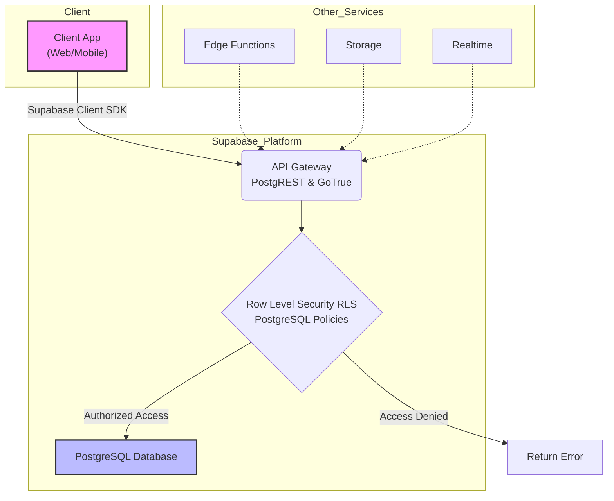

## 前言：不止是 Firebase 的替代品

Supabase，常被誉为“开源的 Firebase 替代品”，但这个标签远不足以概括其全部潜力。它基于强大的 **PostgreSQL** 构建，不仅提供了后端即服务（BaaS）的便捷性，更赋予了开发者掌控数据库完整权限的自由。

本指南将超越“如何连接”的基础层面，带你深入 Supabase 的核心，从架构哲学到安全策略，从性能调优到实战技巧，助你真正驾驭这个强大的工具，构建稳定、安全且可扩展的应用。

---

## 1. 核心架构：理解 Supabase 的工作流

要精通 Supabase，必须先理解其架构。它并非简单地将 PostgreSQL 暴露在公网，而是在其上构建了一套精密的自动化服务层。



**关键组件解读：**

-   **PostgREST (API 网关)**：自动将你的 PostgreSQL 数据库转化为 RESTful API，你无需编写任何后端代码即可实现 CRUD 操作。
-   **GoTrue (认证服务)**：一个基于 JWT 的 API，用于管理用户和颁发访问令牌，支持邮箱、手机号、OAuth 等多种登录方式。
-   **行级安全 (Row Level Security, RLS)**：PostgreSQL 的原生功能，也是 Supabase 安全模型的基石。它允许你为数据库的每一行数据定义精细的访问策略。**所有通过 API 的访问都必须经过 RLS 策略的校验。**
-   **存储 (Storage)**：管理文件存储，如用户头像、文档等，同样受 RLS 策略保护。
-   **实时 (Realtime)**：允许你监听数据库的变更（插入、更新、删除），实现实时数据同步。
-   **Edge Functions**：全球分布的 Deno 函数，用于处理需要低延迟或需要访问私有密钥的后端逻辑。

> **核心理念**：永远不要信任客户端。Supabase 的设计哲学就是通过 RLS 将安全规则强制在数据库层面，即使 API 密钥泄露，没有通过 RLS 策略的请求也无法访问数据。

---

## 2. 安全为本：行级安全 (RLS) 深度实践

忘记传统的后端接口鉴权逻辑，在 Supabase 中，安全始于数据库。

### 2.1 RLS 策略三要素

创建一条 RLS 策略，你需要定义三件事：

1.  **策略名称 (Policy Name)**：一个描述性的名称，如 `允许用户读取自己的个人资料`。
2.  **应用的操作 (FOR ...)**：策略应用于哪种操作，如 `SELECT` (读取), `INSERT` (插入), `UPDATE` (更新), `DELETE` (删除), 或 `ALL` (全部)。
3.  **访问规则 (USING / WITH CHECK)**：
    *   `USING (expression)`：定义**读取**数据时哪些行是可见的。如果表达式返回 `true`，则该行可见。
    *   `WITH CHECK (expression)`：定义**写入**（`INSERT`, `UPDATE`）数据时，新数据必须满足的条件。如果表达式返回 `true`，则允许写入。

### 2.2 实战场景：构建一个多租户 `todos` 应用

假设我们有一个 `todos` 表，每个 `todo` 都属于一个用户。

**表结构：**

```sql
CREATE TABLE todos (
  id BIGINT GENERATED BY DEFAULT AS IDENTITY PRIMARY KEY,
  user_id UUID REFERENCES auth.users(id) ON DELETE CASCADE NOT NULL,
  task TEXT NOT NULL,
  is_completed BOOLEAN DEFAULT FALSE,
  created_at TIMESTAMPTZ DEFAULT NOW()
);

-- 为 user_id 创建索引以优化查询性能
CREATE INDEX idx_todos_user_id ON todos(user_id);
```

**启用 RLS：**

```sql
-- 对 `todos` 表启用行级安全
ALTER TABLE todos ENABLE ROW LEVEL SECURITY;
```

**创建 RLS 策略：**

1.  **策略：用户只能创建属于自己的 `todo`。**

    ```sql
    /*
     * @function create_todos_policy
     * @description 用户只能为自己创建 todo。
     *   - USING: true，因为 INSERT 不涉及读取现有行。
     *   - WITH CHECK: 确保新插入的行的 user_id 与当前认证用户的 ID 一致。
     */
    CREATE POLICY "用户只能为自己创建todo"
    ON todos FOR INSERT
    WITH CHECK ( auth.uid() = user_id );
    ```

2.  **策略：用户只能查看自己的 `todo`。**

    ```sql
    /*
     * @function select_todos_policy
     * @description 用户只能查看自己的 todo。
     *   - USING: 仅当行的 user_id 与当前认证用户的 ID 匹配时，才允许读取。
     */
    CREATE POLICY "用户只能查看自己的todo"
    ON todos FOR SELECT
    USING ( auth.uid() = user_id );
    ```

3.  **策略：用户只能更新自己的 `todo`。**

    ```sql
    /*
     * @function update_todos_policy
     * @description 用户只能更新自己的 todo。
     *   - USING: 确保用户在尝试更新前能看到这行（即这行属于他）。
     *   - WITH CHECK: 确保更新后的 user_id 不能被修改为其他人的 ID。
     */
    CREATE POLICY "用户只能更新自己的todo"
    ON todos FOR UPDATE
    USING ( auth.uid() = user_id )
    WITH CHECK ( auth.uid() = user_id );
    ```

4.  **策略：用户只能删除自己的 `todo`。**

    ```sql
    /*
     * @function delete_todos_policy
     * @description 用户只能删除自己的 todo。
     *   - USING: 仅当行的 user_id 与当前认证用户的 ID 匹配时，才允许删除。
     */
    CREATE POLICY "用户只能删除自己的todo"
    ON todos FOR DELETE
    USING ( auth.uid() = user_id );
    ```

> `auth.uid()` 是一个 Supabase 提供的特殊函数，它返回当前发出请求的、经过身份验证的用户的 UUID。如果用户未登录，它返回 `NULL`。

---

## 3. 客户端集成：优雅地与前端框架协作

### 3.1 环境配置：保护你的密钥

永远不要将 `service_role` 密钥或数据库密码暴露在客户端。

**在你的前端项目根目录创建 `.env.local` 文件：**

```dotenv
# .env.local
# 对于 Vite/Astro 项目，需要 VITE_ 前缀
VITE_SUPABASE_URL="https://<your-project-ref>.supabase.co"
VITE_SUPABASE_ANON_KEY="your-anon-key"

# 对于 Next.js 项目，需要 NEXT_PUBLIC_ 前缀
NEXT_PUBLIC_SUPABASE_URL="https://<your-project-ref>.supabase.co"
NEXT_PUBLIC_SUPABASE_ANON_KEY="your-anon-key"
```

### 3.2 初始化客户端

建议在项目中创建一个单独的文件来管理 Supabase 客户端实例，确保全局单例。

**`src/lib/supabaseClient.ts`**

```typescript
import { createClient } from '@supabase/supabase-js';

// 从环境变量中获取 URL 和 anon key
const supabaseUrl = import.meta.env.VITE_SUPABASE_URL;
const supabaseAnonKey = import.meta.env.VITE_SUPABASE_ANON_KEY;

/**
 * @function getSupabaseClient
 * @description 创建并导出 Supabase 客户端单例。
 * @returns {SupabaseClient} Supabase 客户端实例。
 */
export const supabase = createClient(supabaseUrl, supabaseAnonKey);
```

### 3.3 认证流程实战 (React/Next.js 示例)

Supabase 提供了辅助库来简化认证状态管理。

**安装依赖：**

```bash
pnpm add @supabase/auth-helpers-react @supabase/supabase-js
```

**在 `_app.tsx` (Next.js) 或 `App.tsx` (React) 中设置 Provider：**

```tsx
import { useState } from 'react';
import { createPagesBrowserClient } from '@supabase/auth-helpers-nextjs';
import { SessionContextProvider, Session } from '@supabase/auth-helpers-react';
import type { AppProps } from 'next/app';

function MyApp({ Component, pageProps }: AppProps<{ initialSession: Session }>) {
  /**
   * @function useState
   * @description 创建一个 state 来持有 Supabase 客户端实例，防止在 re-render 时重复创建。
   * @returns {[SupabaseClient, Function]} 客户端实例和设置函数。
   */
  const [supabaseClient] = useState(() => createPagesBrowserClient());

  return (
    <SessionContextProvider
      supabaseClient={supabaseClient}
      initialSession={pageProps.initialSession}
    >
      <Component {...pageProps} />
    </SessionContextProvider>
  );
}

export default MyApp;
```

**在组件中使用：**

```tsx
import { useSupabaseClient, useUser } from '@supabase/auth-helpers-react';
import { useEffect, useState } from 'react';

const TodoListComponent = () => {
  const supabase = useSupabaseClient();
  const user = useUser();
  const [todos, setTodos] = useState<any[]>([]);

  /**
   * @function fetchTodos
   * @description 获取当前用户的 todos 列表。
   *              由于 RLS 策略的存在，无需在查询中显式添加 `where('user_id', 'eq', user.id)`。
   *              Supabase 会在数据库层面自动过滤。
   */
  async function fetchTodos() {
    if (!user) return;
    try {
      const { data, error } = await supabase
        .from('todos')
        .select('*')
        .order('created_at', { ascending: false });

      if (error) throw error;
      setTodos(data || []);
    } catch (error) {
      console.error('Error fetching todos:', (error as Error).message);
    }
  }

  useEffect(() => {
    fetchTodos();
  }, [user]);

  // ... UI 渲染和交互逻辑
  return (
    <div>
      {/* ... */}
    </div>
  );
};
```

---

## 4. 性能优化与最佳实践

1.  **精确查询 `select()`**
    *   **反模式**：`select('*')`
    *   **推荐**：`select('id, task, is_completed')`
    *   **理由**：只请求必要的字段，减少网络负载和数据库压力。

2.  **利用视图 `Views` 和函数 `RPC`**
    *   当需要复杂的 JOIN 或数据聚合时，在 PostgreSQL 中创建 `VIEW` 或 `FUNCTION`。
    *   然后通过 `supabase.from('my_view').select()` 或 `supabase.rpc('my_function', { arg1: 'value' })` 调用。
    *   **理由**：将复杂逻辑下沉到数据库执行，性能远高于在客户端进行多次请求和数据处理。

3.  **合理使用索引**
    *   为经常用于 `where` 条件、`order by` 或 `JOIN` 的列创建索引。
    *   **示例**：在 `todos` 表的 `user_id` 和 `created_at` 上创建索引能极大提升查询速度。
    *   **工具**：使用 `explain` 关键字分析查询计划，如 `explain select * from todos where user_id = '...';`

4.  **分页查询 `range()`**
    *   **反模式**：一次性获取数千条数据。
    *   **推荐**：使用 `.range(from, to)` 实现分页。
        ```javascript
        const { data, error } = await supabase
          .from('todos')
          .select('*')
          .range(0, 9); // 获取前 10 条
        ```
    *   **理由**：避免前端内存溢出和长时间的加载等待。

5.  **订阅精确事件**
    *   **反模式**：`supabase.channel('any').on('*', ...)`
    *   **推荐**：订阅具体的 channel、event、schema 和 table。
        ```javascript
        supabase.channel('todos-channel')
          .on('postgres_changes', {
            event: 'INSERT',
            schema: 'public',
            table: 'todos',
            filter: `user_id=eq.${user.id}` // 只接收与当前用户相关的事件
          }, payload => {
            console.log('New todo:', payload.new);
          })
          .subscribe();
        ```
    *   **理由**：减少不必要的网络流量和客户端计算。

---

## 5. 故障排查清单

遇到问题时，按以下顺序自查：

1.  **✅ RLS 策略检查**
    *   [ ] 表是否已启用 RLS？ (`ALTER TABLE ... ENABLE ROW LEVEL SECURITY;`)
    *   [ ] 针对 `SELECT`, `INSERT`, `UPDATE`, `DELETE` 是否都有对应的策略？
    *   [ ] 策略的 `USING` 和 `WITH CHECK` 表达式是否正确？（特别是 `auth.uid()` 的使用）
    *   [ ] 是否为匿名用户或不同角色的用户创建了策略？

2.  **✅ API 密钥与客户端检查**
    *   [ ] 客户端使用的是 `anon` key 吗？
    *   [ ] `service_role` key 是否意外泄露到前端？
    *   [ ] Supabase 客户端是否成功初始化？URL 和 Key 是否正确？

3.  **✅ 网络与服务状态**
    *   [ ] 浏览器开发者工具的网络(Network)标签页是否有 4xx 或 5xx 错误？
    *   [ ] 查看 [Supabase Status Page](https://status.supabase.com/) 确认服务是否正常。

4.  **✅ 数据库日志**
    *   在 Supabase Dashboard 的 `Database -> Logs` 中查看查询日志，可以发现 RLS 策略失败等详细错误信息。

---

## 总结

精通 Supabase 的关键在于思维模式的转变：**从命令式的后端编码，转向声明式的数据库策略配置**。将安全和数据一致性的核心逻辑下沉到 PostgreSQL，让 Supabase 强大的服务层为你处理繁杂的后端任务。

现在，你已经掌握了 Supabase 的核心思想和实战技巧。去构建你的下一个伟大应用吧！
